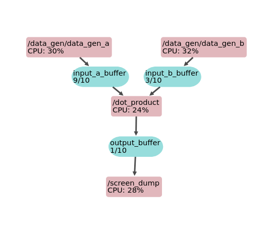

************
Introduction
************

So you like the idea of **Kotekan** and want to get started using it? That's what this page is for!

(This assumes you'e got it installed already. If not, see :ref:`compiling`.)

Running kotekan
---------------

**Using systemd (full install)**

To start kotekan

.. code:: bash

    sudo systemctl start kotekan

To stop kotekan

.. code:: bash

    sudo systemctl stop kotekan

**To run in debug mode, run from `ch_gpu/build/kotekan/`**

.. code:: bash

    sudo ./kotekan -c <config_file>.yaml

When installed kotekan's config files are located at /etc/kotekan/

If running with no options then kotekan just stats a rest server, and waits for someone to send it a config in json format on port **12048**.

.. _user_pipeline_example:

A Simple Pipeline
-----------------

To get things started, let's configure kotekan to generate two buffers full of data with a constant value, dot product those buffers together, and then print out a summary of the results.

`kotekan` runs by parsing a configuration file that describes a pipeline. Each config file is written as a `YAML` file and describes a set of data streams (`Buffers`) through a series of `Stages`.

The YAML file starts with a preamble that sets the logging level, the
set of CPU cores that kotekan is allowed to run on, and any constants we want to use later in the config file:

.. literalinclude:: ../../../config/examples/dot_product.yaml
    :lines: 1-10
    :language: yaml

Next, we declare the input buffers.  In Kotekan configuration files, buffers
and stages can be declared in arbitrary order, so we are free to describe our
pipeline in a way that is readable.

.. literalinclude:: ../../../config/examples/dot_product.yaml
    :lines: 11-19
    :language: yaml

Note that the names `input_buffers`, `input_a_buffer`, and
`input_b_buffer` are arbitrary.  Those names are used within the YAML
file, and their hierarchical arrangement are used by Kotekan to set up
REST endpoints and other labels.

Similarly, we'll create the output buffer:

.. literalinclude:: ../../../config/examples/dot_product.yaml
    :lines: 21-25
    :language: yaml

Next, we will create the producer stages that will fill the input
buffers with data.  These are created as a tree with `data_gen_a` and
`data_gen_b` within a `data_gen` node.

.. literalinclude:: ../../../config/examples/dot_product.yaml
    :lines: 27-37
    :language: yaml

After creating the input stages, we will add the dot-product stage that
reads from those two input buffers and writes to the output buffer.

.. literalinclude:: ../../../config/examples/dot_product.yaml
    :lines: 39-45
    :language: yaml

Finally, we'll add a consumer stage that reads from the output buffer
and prints summary statistics to the screen.

.. literalinclude:: ../../../config/examples/dot_product.yaml
    :lines: 47-50
    :language: yaml

All together now:

.. literalinclude:: ../../../config/examples/dot_product.yaml

One warning is in order: Kotekan buffers don't have types, they are just treated as opaque data.  Each Kotekan stage expects to read or write data in a given type (eg, float32, or uint8), and it is up to the pipeline creator to ensure that stages are compatible!  In this example, all the stages we're using assume float32.

Pipeline Graph
--------------
The graph below shows the pipeline of this example and was generated using the :ref:`Pipeline Viewer <pipeline_viewer>`.

Execute kotekan
---------------
To run `kotekan` move to the binary directory and pass the config file as an argument:

.. code-block:: bash

    cd kotekan
    ./kotekan -c ../../config/examples/dot_product.yaml

