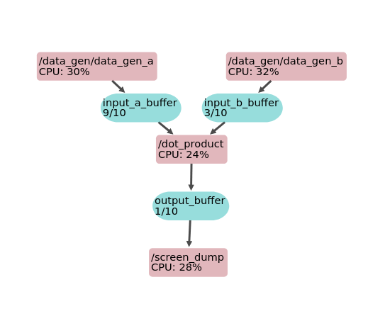

************
Introduction
************

So you like the idea of **Kotekan** and want to get started using it? That's what this page is for!

(This assumes you'e got it installed already. If not, see :ref:`compiling`.)

Running kotekan
---------------

**Using systemd (full install, recommended for production)**

.. code:: bash

    sudo systemctl start kotekan   # stop with: sudo systemctl stop kotekan

Configs installed via packages live at ``/etc/kotekan/``.

**Direct invocation (development/debug)**

.. code:: bash

    sudo ./kotekan -c <config_file>.yaml   # binds 0.0.0.0:12048 by default

Use ``-b <ipv4:port>`` to change the REST bind address/port (IPv4 only), ``-s`` to enable syslog,
and ``-e '{"foo": "bar"}'`` to provide Jinja variables for ``.j2`` configs. Running with no ``-c``
starts the REST server only and waits for a POST to ``/start`` with the config.

.. _user_pipeline_example:

A Simple Pipeline (Quick Start)
-------------------------------

To get things started, let's configure kotekan to generate two buffers full of data with a constant value, dot product those buffers together, and then print out a summary of the results.

`kotekan` runs by parsing a configuration file that describes a pipeline. Each config file is written as a `YAML` file and describes a set of data streams (`Buffers`) through a series of `Stages`.

The YAML file starts with a preamble that sets the logging level, the
set of CPU cores that kotekan is allowed to run on, and any constants we want to use later in the config file:

.. literalinclude:: ../../../config/examples/dot_product.yaml
    :lines: 1-10
    :language: yaml

Next, we declare the input buffers.  In Kotekan configuration files, buffers
and stages can be declared in arbitrary order, so we are free to describe our
pipeline in a way that is readable.

.. literalinclude:: ../../../config/examples/dot_product.yaml
    :lines: 11-19
    :language: yaml

Note that the names `input_buffers`, `input_a_buffer`, and
`input_b_buffer` are arbitrary.  Those names are used within the YAML
file, and their hierarchical arrangement are used by Kotekan to set up
REST endpoints and other labels.

Similarly, we'll create the output buffer:

.. literalinclude:: ../../../config/examples/dot_product.yaml
    :lines: 21-25
    :language: yaml

Next, we will create the producer stages that will fill the input
buffers with data.  These are created as a tree with `data_gen_a` and
`data_gen_b` within a `data_gen` node.

.. literalinclude:: ../../../config/examples/dot_product.yaml
    :lines: 27-37
    :language: yaml

After creating the input stages, we will add the dot-product stage that
reads from those two input buffers and writes to the output buffer.

.. literalinclude:: ../../../config/examples/dot_product.yaml
    :lines: 39-45
    :language: yaml

Finally, we'll add a consumer stage that reads from the output buffer
and prints summary statistics to the screen. This example uses `standard` buffers and does not need
a metadata pool; typed buffers (``vis``, ``N2``, ``hfb``) do require a matching metadata pool.

.. literalinclude:: ../../../config/examples/dot_product.yaml
    :lines: 47-50
    :language: yaml

All together now:

.. literalinclude:: ../../../config/examples/dot_product.yaml

One warning is in order: `standard` buffers are just opaque bytes, while typed buffers (``vis``/``N2``/``hfb``) lock in a specific layout and numeric types (e.g., complex floats for vis/N2, floats for HFB fields). Each stage still expects those payloads, and it is up to the pipeline creator to ensure stages are compatible. In this example, all stages assume float32.

Pipeline Graph
--------------
The graph below shows the pipeline of this example and was generated using the :ref:`Pipeline Viewer <pipeline_viewer>`.

Execute kotekan
---------------
To run `kotekan` move to the binary directory and pass the config file as an argument:

.. code-block:: bash

    cd kotekan
    ./kotekan -c ../../config/examples/dot_product.yaml
